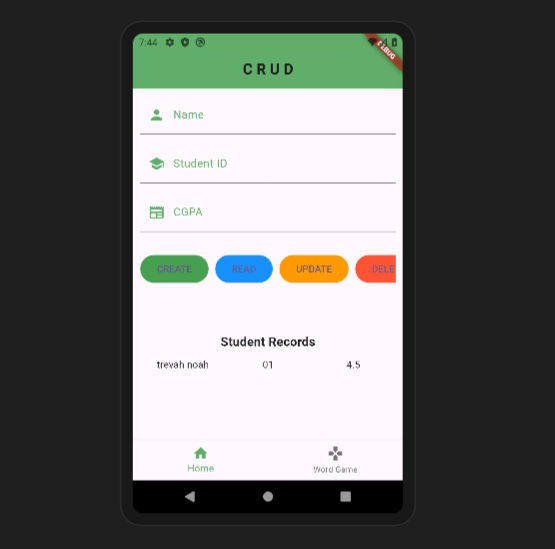
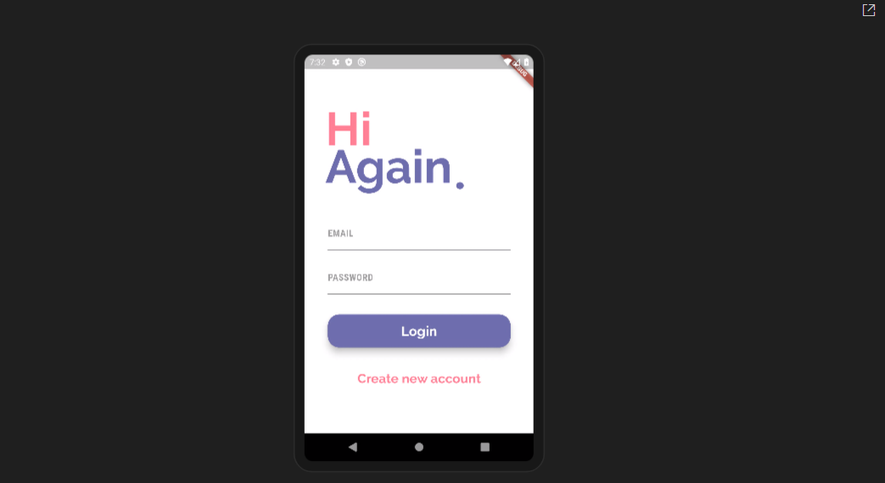
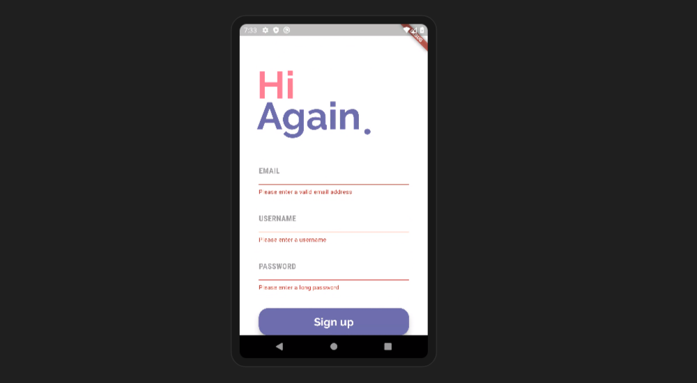
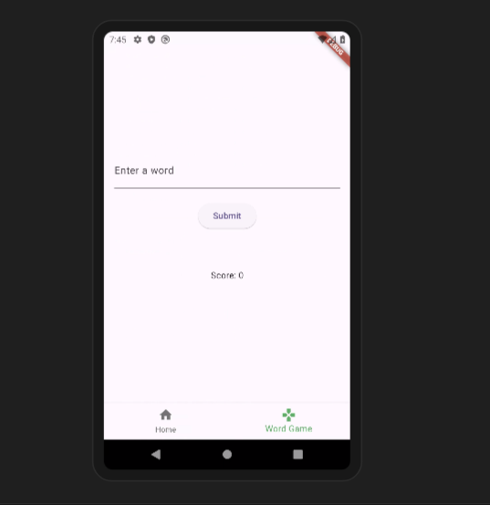
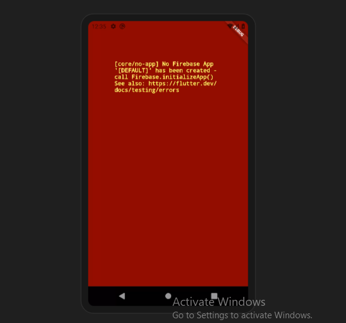
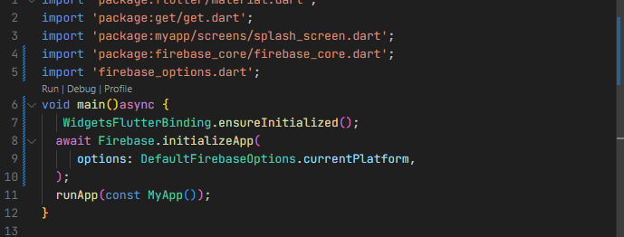

# My Flutter App

## Table of Contents

- [Introduction](#introduction)
- [Prerequisites](#prerequisites)
- [Getting Started](#getting-started)
- [Firebase Setup](#firebase-setup)
- [Running the App](#running-the-app)
- [UI Screenshots](#ui-screenshots)
- [bug created within the firebase configuration and Solution](#common-issue-and-solution)
- [Environment Details](#environment-details)

## Introduction

This is a flutter app for an assignement given 

## Prerequisites

Before you begin, ensure you have met the following requirements:

- You have installed Flutter SDK.
- You have installed Dart SDK.
- You have a Firebase project set up.

## Getting Started

Follow these steps to get started with the project:

1. Clone the repository:

```sh
git clone https://github.com/Naluswa256/myapp.git

```
2. Navigate to the project directory:
```sh
cd myapp
```
3. Install dependencies:

```sh
flutter pub get
```
4. Run the app:

```sh
flutter run
```








## Error created within the code 





solution to the error create is if you dont intialize firebase within the main.dart file 




## Enviroments 
Flutter 3.22.2
Dart 3.4.3